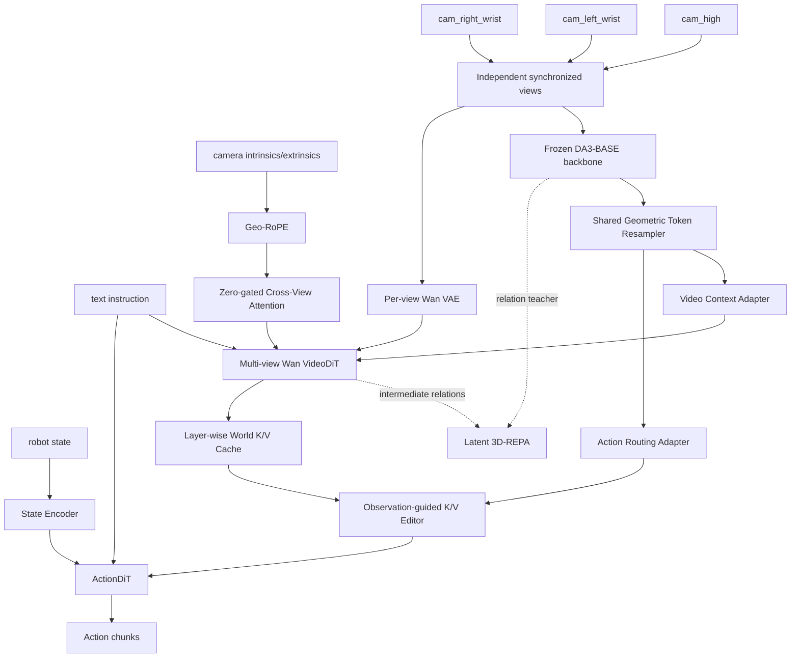

# DA3 共享视觉主干 + PAIWorld 增强型 VideoDiT 世界模型方案

## 1. 决策

采用“目标一 / 方案 B+”：保留 AHA-WAM 的世界模型能力，在线复用 Depth Anything 3 的 DINO backbone 作为多视角共享视觉主干，同时借鉴 PAIWorld，把显式跨视角通信和 3D 几何监督注入 VideoDiT。仅把 DA3 feature 作为 context 不足以保证生成分支的跨视角一致性；VideoDiT 自身也必须具备跨视角信息通路和几何学习目标。

首版使用 `depth-anything/DA3-BASE` checkpoint：

- DA3 backbone 与可选 `cam_enc` 直接从 checkpoint 加载并冻结；
- DA3 feature 一方面经 resampler 服务 Video/Action，另一方面作为 Latent 3D-REPA teacher；
- Wan VAE 按视角独立编码视频，不再把三视角拼成一张世界模型输入；
- Wan VideoDiT 新增 zero-gated Geometry-Aware Cross-View Attention 和 Geo-RoPE；
- 保留 Wan VideoDiT、ActionDiT 及 flow-matching 主目标；
- 不加载到控制路径的模块：DA3 depth head、camera decoder、GS head；
- 不在首版缩小或替换 Wan VideoDiT，避免同时改变世界模型容量和 checkpoint 初始化。

目标结构：



这里 Wan VAE 是逐视角视频生成 latent codec，不视为独立的动作视觉主干。DA3 提供在线共享空间感知和冻结几何 teacher；增强后的 VideoDiT 通过 Cross-View Attention、Geo-RoPE 与 3D-REPA 学习多视角时空 world model；ActionDiT 承担动作生成。

## 2. 目标与非目标

### 2.1 目标

1. 保留三路相机的独立视角维，不再依赖二维拼图学习跨视角关系。
2. 复用 DA3 checkpoint 的多视角空间和几何表示。
3. VideoDiT 与 ActionDiT 消费同源的 shared geometric tokens。
4. VideoDiT 在每个时间点具备显式 Cross-View Attention，而不是只把多视角 token 平铺。
5. Geo-RoPE 使用逐像素相机射线和逐视角 pose 约束跨视角 attention。
6. Latent 3D-REPA 将 VideoDiT 中间 token relation 对齐到冻结 DA3 feature。
7. 保留 VideoDiT 的视频 flow-matching loss和 AHA-WAM 的异步世界/动作解耦。
8. 首版兼容现有 Wan VideoDiT、ActionDiT 初始化权重，但采用新的 checkpoint schema。
9. 部署时每个新多视角观测只计算一次 DA3 feature，Video/Action 分支复用缓存结果。

### 2.2 非目标

1. 不用 DA3 直接替换 Wan VideoDiT。
2. 不让 DA3 输出深度图后再把深度图当作唯一控制输入。
3. 不在首版联合微调 DA3 全部参数。
4. 不在首版引入 3D Gaussian head、点云重建或显式 TSDF。
5. 不把 `T × V` 的全部历史帧和视角一次性展平送入 DA3 global attention。
6. 不保留旧模型结构的运行时兼容分支；旧 checkpoint 通过一次性转换脚本迁移。

## 3. 当前系统基线

当前 RoboTwin 数据包含：

- `cam_high`；
- `cam_left_wrist`；
- `cam_right_wrist`。

当前数据管线将三路相机拼成 `[384, 320]` 复合帧，再交给 Wan VAE。动作侧 observation context 也来自 Wan VAE latent，经 `action_obs_visual_proj` 和 `MultiQueryChunkObsEncoder` 生成 routing query。

当前职责：

```text
Wan VAE + VideoDiT:
    视频 latent 编码、视频 flow-matching、世界 K/V cache

ActionDiT:
    动作 flow-matching、chunk causal action generation

OVCR/KV editor:
    使用最新 observation 更新 VideoDiT 第一帧 K/V
```

本方案保留 VideoDiT 训练目标和 K/V 语义，但将动作侧的 observation feature 来源切换为 DA3，并让 VideoDiT 同时读取同一份 DA3 几何 token。

## 4. 输入与数据契约

### 4.1 数据输出

数据集以一份未拼接的同步多视角视频作为视觉真值：

```python
sample["multi_view_video"]  # [B,T,V,3,H,W], RGB, float [0,1]
```

其中：

```text
V = 3
view order = [cam_high, cam_left_wrist, cam_right_wrist]
```

DA3 在单个时间点读取 `[B,V,3,H_da3,W_da3]`；Wan VAE 将输入转为 `[B,V,3,T,H_vae,W_vae]` 后展平为 `[B*V,3,T,H_vae,W_vae]` 编码，再恢复 view 轴交给 multi-view VideoDiT。DA3 与 VAE 可以使用不同的合法分辨率，但必须来自同一原图、同一时间戳和等价视场裁剪，并同步更新相机内参。复合拼图只保留为旧基线消融，不进入目标模型。

### 4.2 DA3 输入

每个时间点独立进行三视角融合：

```python
images = multi_view_video[:, t]  # [B, V, 3, H, W]
```

输入尺寸必须：

- 三个视角具有相同 `H, W`；
- `H, W` 可被 DA3 patch size 14 整除；
- 首版建议统一到接近现有 `240 × 320` 的 14 倍数，例如 `238 × 322`，具体尺寸由一次显存/延迟 smoke benchmark 决定；
- 不允许先拼图再送入 DA3。

### 4.3 双路归一化

从同一份 RGB `[0, 1]` 分叉：

```python
vae_images = rgb * 2.0 - 1.0

da3_images = (rgb - imagenet_mean) / imagenet_std
```

其中：

```python
imagenet_mean = [0.485, 0.456, 0.406]
imagenet_std = [0.229, 0.224, 0.225]
```

禁止将 Wan 的 `[-1, 1]` tensor 直接送入 DA3，也禁止将 ImageNet-normalized tensor 送入 Wan VAE。

### 4.4 相机参数

可选输入：

```python
intrinsics  # [B, T, V, 3, 3]
extrinsics  # [B, T, V, 4, 4], world-to-camera
```

规则：

1. 固定 head camera 可以使用离线标定。
2. wrist camera extrinsics 必须根据关节状态、正向运动学和 hand-eye calibration 动态计算。
3. 相机参数不准确时不传，使用 DA3 unposed multi-view 模式。
4. 禁止将腕部相机外参错误地固定为常量。

## 5. DA3 checkpoint 使用方式

### 5.1 模型选择

首选：

```text
depth-anything/DA3-BASE
```

理由：

- 约 0.12B 参数；
- ViT-B/14；
- 支持 multi-view local/global alternating attention；
- backbone embedding dim 768；
- `cat_token=true` 后输出 dim 1536；
- checkpoint 为 Apache 2.0；
- 相比 LARGE/GIANT 更适合异步机器人部署。

实时性不足时的降级目标为 `DA3-SMALL`，但不是首版默认。

### 5.2 加载流程

必须通过 DA3 自身 loader 加载完整 checkpoint，再提取模块：

```python
loaded = DepthAnything3.from_pretrained(da3_model_id)
network = loaded.model

visual_backbone = network.backbone
camera_encoder = network.cam_enc
```

不直接手工过滤 `model.safetensors` key；这样可以复用 DA3 的 config、key conversion 和版本兼容逻辑。

提取后释放：

```text
network.head
network.cam_dec
network.gs_head
network.gs_adapter
DepthAnything3.input_processor
DepthAnything3.output_processor
```

### 5.3 训练状态

首版：

```python
visual_backbone.eval()
visual_backbone.requires_grad_(False)

camera_encoder.eval()
camera_encoder.requires_grad_(False)
```

不能调用带 `@torch.inference_mode()` 的 `DepthAnything3.forward()` 参与训练图；模型内部直接调用抽出的 `backbone` 和 `cam_enc`。

## 6. 新模型组件

### 6.1 `DA3VisualBackbone`

建议文件：

```text
src/ahawam/models/vision/da3_backbone.py
```

接口：

```python
class DA3VisualBackbone(nn.Module):
    def forward(
        self,
        images: torch.Tensor,             # [B,V,3,H,W]
        extrinsics: torch.Tensor | None,  # [B,V,4,4]
        intrinsics: torch.Tensor | None,  # [B,V,3,3]
    ) -> dict[str, torch.Tensor]:
        ...
```

输出：

```python
{
    "patch_tokens": tokens,        # DA3-BASE: [B,V,P,1536]
    "camera_tokens": cam_tokens,   # [B,V,1536] 或对应 backbone 输出
    "view_mask": view_mask,        # [B,V]
}
```

只取 DA3 最后一个 configured output layer；首版不融合四层 pyramid feature，避免引入未经验证的多尺度复杂度。

### 6.2 `SharedGeometricTokenResampler`

建议放置：

```text
src/ahawam/models/vision/geometric_resampler.py
```

接口：

```python
class SharedGeometricTokenResampler(nn.Module):
    def forward(
        self,
        patch_tokens: torch.Tensor,  # [B,V,P,C_da3]
        view_mask: torch.Tensor,     # [B,V]
    ) -> tuple[torch.Tensor, torch.Tensor]:
        ...
```

默认输出：

```text
shared_tokens: [B, 32, 4096]
shared_mask:   [B, 32]
```

推荐结构：

```text
LayerNorm(1536)
Linear(1536 → 4096)
32 个 learned queries
单层或双层 cross-attention resampler
zero-gated output projection
```

约束：

1. resampler 必须保留 view identity，可使用 DA3 输出中的 view axis 或新增固定 view embedding。
2. 输出 token 数固定，避免输入分辨率改变 Video/Action cross-attention 成本。
3. 初始 gate 接近 0，使现有 VideoDiT/ActionDiT checkpoint 在接入新条件时行为平稳。
4. 同一个 resampler 输出对象同时传给 Video 和 Action，不为两个分支建立两套视觉 encoder。

### 6.3 Video context adapter

首版使用最小改造：把 shared geometric tokens 追加到 VideoDiT 文本 context。

```python
video_context = torch.cat([text_context, shared_tokens], dim=1)
video_context_mask = torch.cat([text_mask, shared_mask], dim=1)
```

VideoDiT 的 `text_dim=4096`，所以 resampler 输出直接匹配现有 cross-attention 输入维度。

必要约束：

- 保存文本 token 与几何 token 的 segment/type embedding；
- VideoDiT self-attention、3D RoPE、timestep modulation 和视频输出 head 不变；
- 首版不把 DA3 token 写入 VideoDiT self-attention 序列，避免改变视频 causal mask 和输出 token 对齐。

### 6.4 Action routing adapter

替换当前动作侧视觉路径：

```text
旧：Wan VAE obs latent
    → action_obs_visual_proj
    → MultiQueryChunkObsEncoder
    → layer-wise K/V editor

新：DA3 shared geometric tokens
    → ActionRoutingAdapter
    → layer-wise K/V editor
```

建议沿用现有 `MultiQueryChunkObsEncoder` 的 query 接口，但输入改为 `[B,N_chunks,32,4096]` 的 shared geometric tokens。

robot state 保持独立：

```text
state → proprio_encoder → 每个 chunk 一个 state token
```

ActionDiT 首版仍然通过：

- 文本 cross-attention；
- state token；
- observation-guided updated VideoDiT K/V；

获取条件。首版不额外让所有 action tokens 直接 cross-attend 全部 DA3 patch token。

## 7. 训练时序与 tensor 契约

### 7.1 Video world context

对于每个训练窗口，DA3 按时间点处理同步视角：

```python
views_t = multi_view_video[:, t]                 # [B,V,3,H,W]
da3_features_t = da3_backbone(views_t)           # frozen teacher/shared stem
shared_tokens_t = resampler(da3_features_t)      # [B,Q,4096]
```

Wan VAE 对每个视角独立编码，VideoDiT 保留显式 `[B,V,T,P,D]` 逻辑。`shared_tokens_t` 条件化 VideoDiT；VideoDiT 在选定层对同一时间点的不同视角执行 Cross-View Attention，并从其中间层抽取 feature 计算 3D-REPA。

### 7.2 Chunk-aligned action context

每个 action chunk 使用 chunk start 对应的三视角观测：

```python
chunk_views  # [B,N_chunks,V,3,H,W]
```

展平 batch 和 chunk，而不展平 view：

```python
flat = chunk_views.reshape(B * N_chunks, V, 3, H, W)
flat_features = da3_backbone(flat)
flat_shared = resampler(flat_features)
chunk_shared = flat_shared.reshape(B, N_chunks, Q, 4096)
```

禁止将 `N_chunks × V` 视为一次 DA3 的 view 数量；否则 global attention 复杂度和语义都会混入时间维。

### 7.3 Loss

首版总损失改为：

```text
L = lambda_video * L_video_flow
  + lambda_action * L_action_flow
  + lambda_repa * (L_repa_spatial + L_repa_temporal)
```

`L_repa_spatial` 在同一时间点的全部视角/空间 token 上对齐 sampled cosine relations；`L_repa_temporal` 在整段 clip 上对齐跨帧 relations。使用 anchor sampling 将完整 token-token 二次复杂度降为 `O(MK)`，以 SmoothL1 对齐 VideoDiT 与冻结 DA3 的 relation matrix。PAIWorld 使用 `lambda_repa=0.5`，本项目以该值作为初始实验点，不把它视为无需验证的固定常数。

新增记录：

```text
shared_token_norm
shared_adapter_gate
video_context_attention_norm
kv_editor_delta_norm
DA3 forward latency
DA3 cache hit rate
```

这些是诊断指标，不进入 loss。

## 8. 训练阶段

### 8.1 Adapter warm-up

冻结：

- DA3 backbone/cam encoder；
- Wan VAE；
- text encoder；
- VideoDiT；
- ActionDiT。

训练：

- shared geometric token resampler；
- Video context segment/gate；
- Action routing adapter；
- layer-wise K/V editor；
- state encoder。

目的：先让新视觉条件进入现有两个预训练分支，避免随机 adapter 梯度直接扰动大模型。

### 8.2 Joint world-action training

继续冻结 DA3、Wan VAE 和 text encoder，解冻：

- VideoDiT；
- ActionDiT；
- MoT/KV editor；
- 全部新 adapter。

继续使用视频和动作联合 flow-matching loss。

### 8.3 可选 DA3 局部微调

只有在冻结 DA3 的目标架构已经通过完整评测后，才允许实验：

- 解冻 DA3 最后 2～4 层；
- 使用显著小于 Video/Action 分支的学习率；
- A/B 对比几何泛化、动作成功率和 checkpoint 大小。

这不是首版验收条件。

## 9. 异步推理设计

### 9.1 三类缓存

部署状态拆成：

```text
PerceptionCache:
    最新 DA3 shared geometric tokens
    相机时间戳
    perception version

WorldCache:
    VideoDiT per-layer K/V
    对应 perception version
    world version

ActionRequest:
    最新 state
    读取最新 PerceptionCache
    使用其 token 更新 WorldCache 的第一帧 K/V
```

### 9.2 调度优先级

推荐：

```text
Priority 1: Action chunk inference
Priority 2: DA3 perception prefill（只保留最新三视角帧）
Priority 3: VideoDiT world prefill
```

ActionDiT 不在每个 diffusion step 重跑 DA3。DA3 只在新的同步多视角 observation 被接受时运行一次，其输出被整个 action chunk 的 denoising steps 复用。

### 9.3 版本一致性

每个缓存包含：

```python
{
    "version": int,
    "timestamp": float,
    "view_timestamps": dict[str, float],
}
```

规则：

1. 三视角最大时间差超过阈值则丢弃该 observation bundle。
2. Action 可以读取较新的 PerceptionCache 去更新较旧的 WorldCache，这是 OVCR 的预期行为。
3. WorldCache 超过最大 staleness 时拒绝 action request。
4. 更新缓存必须原子发布，禁止 Action 读取到一半旧、一半新的多层 K/V。

### 9.4 部署协议

输入从：

```python
{"images": {"front": image}}
```

改为：

```python
{
    "images": {
        "cam_high": high,
        "cam_left_wrist": left,
        "cam_right_wrist": right,
    },
    "image_timestamps": {
        "cam_high": t0,
        "cam_left_wrist": t1,
        "cam_right_wrist": t2,
    },
    "state": state,
}
```

同步与异步协议都必须迁移；不保留仅 `front` 的隐式 fallback。需要单相机部署时，使用显式的单视角模型配置和 checkpoint。

## 10. Checkpoint 设计

### 10.1 三个初始化来源

新模型从三个 checkpoint 初始化：

```text
DA3 checkpoint:
    visual_backbone + optional cam_enc

Wan checkpoint:
    VAE + VideoDiT + text components

AHA-WAM/ActionDiT checkpoint:
    ActionDiT + MoT/KV editor 可迁移权重
```

新增 adapter 随机或 zero-gated 初始化。

### 10.2 新 schema

建议 checkpoint 使用显式版本：

```python
{
    "format_version": 2,
    "architecture": "ahawam_da3_shared_world",
    "da3": {
        "model_id": "depth-anything/DA3-BASE",
        "revision": "<pinned revision>",
        "trainable": False,
    },
    "mot": ...,
    "shared_geometric_resampler": ...,
    "video_context_adapter": ...,
    "action_routing_adapter": ...,
    "proprio_encoder": ...,
    "step": ...,
    "optimizer": ...,
}
```

DA3 冻结时不重复保存其权重，只保存 model ID 和固定 revision。DA3 被微调后，必须额外保存 `visual_backbone` 和 `camera_encoder` state dict。

### 10.3 旧 checkpoint 迁移

提供一次性转换脚本：

```text
scripts/convert_ahawam_checkpoint_to_da3_shared.py
```

迁移：

- `mot.mixtures.video.*`；
- `mot.mixtures.action.*`；
- `proprio_encoder.*`；
- 可兼容的 KV editor 权重。

不迁移：

- `action_obs_visual_proj.*`；
- 旧 VAE observation query 输入适配器。

新 shared resampler 和 Action routing adapter 使用新初始化。运行时 loader 只接受新 schema，不在模型代码内长期保留旧结构分支。

## 11. 配置面

新增模型配置：

```text
configs/model/ahawam_da3_shared_world.yaml
```

核心字段：

```yaml
da3:
  model_id: depth-anything/DA3-BASE
  revision: <pinned-revision>
  freeze: true
  output_layer: 11
  input_size: [238, 322]
  use_camera_encoder: false
  ref_view_strategy: saddle_balanced

shared_geometric_tokens:
  input_dim: 1536
  output_dim: 4096
  num_queries: 32
  num_layers: 2
  gate_init: -4.0

video_conditioning:
  append_to_text_context: true
  use_segment_embedding: true

action_conditioning:
  use_shared_tokens_for_kv_editor: true
  direct_cross_attention: false
```

新增数据配置或修改 RoboTwin 配置，使 processor 输出独立的 `multi_view_video`。原 `concat_multi_camera: robotwin` 仅为 Wan VAE 视频目标生成服务，不再是 DA3 输入。

## 12. 预计修改文件

### 数据

```text
configs/data/robotwin.yaml
src/ahawam/datasets/lerobot/robot_video_dataset.py
src/ahawam/datasets/lerobot/processors/ahawam_processor.py
```

### 模型

```text
src/ahawam/models/vision/da3_backbone.py
src/ahawam/models/vision/geometric_resampler.py
src/ahawam/models/wan22/base_wam.py
src/ahawam/models/wan22/ahawam_chunk_base.py
src/ahawam/models/wan22/ahawam.py
src/ahawam/models/wan22/mot.py
src/ahawam/runtime.py
src/ahawam/trainer.py
```

### 配置和脚本

```text
configs/model/ahawam_da3_shared_world.yaml
configs/task/robotwin_ahawam_da3_shared_world.yaml
scripts/convert_ahawam_checkpoint_to_da3_shared.py
```

### 部署

```text
deploy/server/ahawam_policy.py
deploy/server/async_runtime.py
deploy/server/wam_policy_server.py
deploy/client/wam_remote_client_node.py
experiments/robotwin/ahawam_policy/deploy_policy.py
```

### 依赖

AHA-WAM 需要显式声明 DA3 core dependency。开发环境可以安装：

```bash
pip install -e ../depth-anything-3
```

正式配置不能依赖未声明的相邻目录；应固定包来源或将 DA3 core 作为明确的可安装依赖。避免为了 backbone 引入 DA3 UI、Open3D、COLMAP 和 GS 等非必要运行时依赖。

## 13. 实施顺序

1. 修改数据管线，输出同步独立多视角视频和相机参数；复合拼图仅保留为基线。
2. 将 Wan VAE 编码改为逐视角 flatten/unflatten，验证重建和时序对齐。
3. 新增 DA3 core dependency 与 `DA3VisualBackbone`，验证 checkpoint 严格加载和 feature shape。
4. 实现 shared geometric resampler，跑通 DA3-online context-only 基线。
5. 将 VideoDiT token contract 改为显式 view 轴，先跑通无跨视角模块的 per-view flow loss。
6. 实现 zero-gated Cross-View Attention，验证 step zero 与原预训练分支等价。
7. 实现 ray/pose split Geo-RoPE，并验证内外参变换、腕部动态外参和 view permutation。
8. 实现 Latent 3D-REPA projector、anchor sampling 及 spatial/temporal relation loss。
9. 将 Action routing 从 VAE obs latent 切换到 shared geometric token，跑通 K/V editor。
10. 实现新 checkpoint schema、旧 checkpoint 转换和 perception/world cache。
11. 修改同步/异步多相机协议与 RoboTwin adapter。
12. 依次完成 adapter warm-up、world geometry warm-up、joint world-action training 和消融。

## 14. 验收标准

### 14.1 模型加载

- `DA3-BASE` checkpoint 能通过 DA3 loader 完整加载。
- 抽出的 backbone 和 cam encoder 权重无 missing/unexpected key。
- depth/camera-decoder/GS head 不进入 AHA-WAM 参数树。
- DA3 冻结时 optimizer 中没有 DA3 参数。

### 14.2 数据与 shape

- 原始输入严格为 `[B,T,V,3,H,W]`，`V=3`，view 顺序固定并具名。
- Wan VAE 逐视角编码，目标 VideoDiT 不读取复合拼图。
- DA3-BASE 输出 patch token 最后一维为 1536。
- Resampler 输出严格为 `[B,32,4096]`，chunk 路径为 `[B,N_chunks,32,4096]`。
- VideoDiT 中间 token 保留可逆的 `[B,V,T,P,D]` 布局。
- Geo-RoPE 的 ray 与 pose 子空间维度之和等于 cross-view attention head dim。
- DA3 与 VideoDiT relation projector 输出具有相同 token 布局和 relation sampling index。

### 14.3 训练行为

- `loss_video`、`loss_action`、`loss_repa_spatial`、`loss_repa_temporal` 均为有限值。
- DA3 始终无梯度；REPA target 必须 detach。
- Zero gate 初始化时，新增 Cross-View Attention 对 VideoDiT 输出的增量为 0。
- Adapter warm-up 时 VideoDiT、ActionDiT 无梯度，新 adapter/CVA/KV editor 有梯度。
- Joint training 时 VideoDiT、ActionDiT、adapter/CVA/KV editor 有梯度。
- 同一份 DA3 feature 同时用于 shared context 和 REPA teacher，不能重复运行 DA3。
- Video branch 继续预测逐视角视频 latent flow；Action branch继续预测 action flow。

### 14.4 推理行为

- 一组同步三视角图像只触发一次 DA3 forward。
- 同一个 perception version 可被多次 action denoising step 复用。
- Action request 可使用最新 perception token 更新较旧 world K/V。
- 超时 world cache 会拒绝 action，而不是静默使用无限陈旧状态。
- 多层 K/V cache 原子发布。
- `reset` 同时清理 perception、world、action history 和版本计数。

### 14.5 端到端验证

必须报告：

```text
RoboTwin task success rate
video prefill latency p50/p95
DA3 perception latency p50/p95
action chunk latency p50/p95
peak GPU memory
cache staleness distribution
```

至少比较：

```text
A. 当前 AHA-WAM：三视角拼图，无显式几何
B. DA3-online context-only：原方案 B，不加 CVA/Geo-RoPE/REPA
C. Multi-view VideoDiT + CVA/Geo-RoPE，不加 REPA
D. Multi-view VideoDiT + REPA，不加 CVA/Geo-RoPE
E. 完整方案 B+：DA3 online + CVA/Geo-RoPE + REPA + ActionDiT
```

必须同时报告动作成功率、生成质量和跨视角几何指标。只有完整方案相对 B/C/D 显示稳定收益，才能证明在线 DA3、显式通信和几何监督各自的成本合理。

## 15. 风险与处理

### 15.1 计算重复

风险：DA3 做空间编码，Wan VAE/VideoDiT 仍处理复合视频。

处理：首版接受该重复以保留 Wan checkpoint 和视频生成目标；完成消融后再评估用轻量 temporal world transformer 替代完整 Wan VideoDiT，不在首版同时实施。

### 15.2 多视角 token 过多

风险：直接将所有 patch token送入 Video/Action 分支会增加二次注意力开销。

处理：固定 32 个 resampled tokens；不将时间维混入 DA3 view 维。

### 15.3 腕部相机外参错误

风险：错误 camera token 会系统性破坏跨视角融合。

处理：没有动态标定时使用 unposed 模式；外参接入必须有独立几何检查。

### 15.4 DA3 表征被动作训练破坏

风险：联合微调使几何能力退化。

处理：首版冻结 DA3；局部解冻是后续独立消融，不作为默认。

### 15.5 新条件破坏预训练 VideoDiT

风险：随机 shared token 改变 cross-attention 分布。

处理：zero-gated adapter、adapter warm-up、固定文本/几何 segment embedding。

### 15.6 许可

风险：DA3 仓库代码和不同模型权重许可不同。

处理：默认只使用 Apache 2.0 的 DA3-BASE/SMALL；不使用 CC BY-NC 的 LARGE/GIANT 作为可商业发布默认权重。

## 16. 最终边界

本方案的最终职责划分固定为：

```text
DA3-BASE:
    在线多视角空间/几何感知
    训练期冻结 3D relation teacher

Multi-view Wan VideoDiT:
    逐视角未来视频 latent/world dynamics
    Cross-View Attention 提供显式视角通信
    Geo-RoPE 将相机射线和 pose 注入通信路径
    低频生成可复用 layer-wise world K/V

Latent 3D-REPA:
    约束 VideoDiT 的空间与时间 token relation 接近 DA3

ActionDiT:
    高频闭环 action chunk diffusion

Shared resampler + OVCR:
    让 Video 和 Action 使用同源几何 token
    用最新观测更新复用中的 world context
```

首版成功标准不是“模型能够加载”，而是逐视角 VAE、DA3 shared tokens、CVA、Geo-RoPE、3D-REPA、VideoDiT world loss、ActionDiT action loss和异步缓存链路全部端到端工作，并通过完整消融证明各组件收益。

## 17. PAIWorld 对比与借鉴结论

参考论文：[PAIWorld: A 3D-Consistent World Foundation Model for Robotic Manipulation](https://arxiv.org/html/2606.18375)。

### 17.1 比“直接使用 DA3”高级在哪里

| 维度 | DA3-online context-only | PAIWorld 思路 |
|---|---|---|
| DA3 角色 | 推理期视觉 backbone | 冻结的训练期 3D teacher |
| 跨视角通信 | 主要发生在 DA3 内部，VideoDiT 未必通信 | VideoDiT 内显式 Cross-View Attention |
| 相机几何 | DA3 camera token 或隐式 feature | ray + pose 直接进入 attention Q/K 的 Geo-RoPE |
| 几何监督 | 依赖 DA3 feature 被下游正确使用 | 用 3D-REPA 直接监督 DiT 中间 relation |
| 多视角生成 | context 可能改善表征，但不保证各 view 输出一致 | 通信路径和监督目标共同约束逐视角生成 |
| 推理成本 | 必须在线运行 DA3 | 原论文训练后可不运行 DA3 |

直接使用 DA3 只回答“给模型更好的几何输入”。PAIWorld进一步解决两个不同问题：VideoDiT 是否具有跨视角传递信息的结构，以及 VideoDiT 被什么目标约束为真正的 3D 一致。论文消融显示，CVA-only 和 REPA-only 的 MEt3R 改善分别为 0.93 和 0.72，同时使用时改善为 2.64；这支持“通路 + 监督”需要联合存在，但不能直接推出在 AHA-WAM/RoboTwin 上有相同增益。

### 17.2 可直接借鉴的三个组件

1. **Geometry-Aware Cross-View Attention**：在 VideoDiT 选定层、同一时间点内聚合所有视角 K/V；使用 zero gate 保持预训练模型在 step zero 的函数等价。
2. **Geo-RoPE**：cross-view attention 的每个 head 分为 ray 和 pose 两部分。ray 来自 `K^-1 [u,v,1]` 经相机旋转变换到公共坐标系；pose 来自旋转、平移、相机位置和光轴。
3. **Latent 3D-REPA**：不逐 token 回归 DA3 feature，而是对齐 anchor-sampled cosine relation。分别计算单帧跨视角空间关系与整段 clip 时间关系。

### 17.3 不直接照搬的部分

1. PAIWorld 基于约 14B Cosmos-Predict2.5、2.5M clips 和约 30k H200 GPU-hours；其规模结论不能直接外推到 Wan 5B + RoboTwin。
2. 论文使用 action map 条件化世界生成。AHA-WAM 的异步 action executor 在 world prefill 时尚未得到未来动作，首版不能引入循环依赖；action map 仅用于候选动作 rollout 或独立 model-based planning 实验。
3. 原论文可以训练后移除 DA3；本方案仍保留在线 DA3 服务 Action routing。是否蒸馏后移除在线 DA3，必须作为后续独立消融。
4. Spatial-concat global attention 成本高。首版先实现 dedicated CVA；只有 dedicated CVA 不足时才增加 periodic spatial-concat attention。

### 17.4 实施优先级

```text
P0  独立多视角数据、逐视角 VAE、相机标定/FK
P1  Multi-view VideoDiT token layout + zero-gated CVA
P2  Geo-RoPE
P3  DA3 teacher + spatial/temporal 3D-REPA
P4  DA3 shared token 接入 Action routing
P5  异步 perception/world/action cache
P6  在线 DA3 是否可被蒸馏移除的消融
```

几何组件依赖准确相机模型。固定 head camera 使用标定外参；腕部相机必须由机器人状态和正向运动学计算动态外参。若这项前置条件不成立，应先实现 unposed DA3 teacher + view embedding 基线，不应伪造 Geo-RoPE pose。

## 18. 训练数据与 Checkpoint 清单

### 18.1 最小可训练数据

完整方案 B+ 的每个 episode 至少需要：

```text
同步多视角 RGB:
    cam_high
    cam_left_wrist
    cam_right_wrist

时间信息:
    每帧 timestamp
    episode boundary
    frame/action 对齐

控制信息:
    14-D robot state
    14-D action
    action/state padding mask

语义信息:
    task instruction

相机信息:
    每个视角的 3x3 intrinsics
    每帧每视角的 4x4 world-to-camera extrinsics
```

不要求真实 depth、point cloud 或 3D mesh 标签；DA3 作为冻结 teacher 提供 3D relation target。Geo-RoPE 则要求可靠相机参数。

现有 LeRobot RoboTwin 配置只声明三路 RGB、state、action 和 task，没有把 intrinsics/extrinsics 暴露给 sample。上游 RoboTwin camera API 能返回 `intrinsic_cv`、`extrinsic_cv` 和 `cam2world_gl`，因此完整 Geo-RoPE 需要从 raw RoboTwin 重新转换或扩展数据采集，把这些字段逐帧保存。无法取得动态 wrist extrinsics 时，只能训练 CVA + unposed DA3-REPA 基线，不能伪造 pose。

### 18.2 数据集分级

#### 最小原型

```text
RoboTwin2.0
```

用途：

- 跑通三视角数据、逐视角 VAE、CVA、Geo-RoPE、REPA、ActionDiT；
- 做目标任务成功率和结构消融；
- 验证仿真相机参数及 wrist 动态外参。

当前公开预处理版可用于无 Geo-RoPE 的 bring-up；完整目标需要补充相机标定字段。

#### 推荐世界模型预训练

优先组合：

```text
RoboCOIN + RoboTwin2.0
```

若数据访问和许可允许，再扩展：

```text
AgiBot-World
RoboMIND
Galaxea
```

PAIWorld 使用约 2.5M multi-view clips，来源比例为 AgiBot-World 35%、RoboMIND 20%、Galaxea 15%、RoboTwin 15%、RoboCOIN 15%。本项目不要求复刻比例；选择标准是同步多视角、时间连续、动作/状态可对齐、相机参数可恢复。

#### 目标机器人微调

真实部署还需要与目标机器人一致的数据：

```text
相同 head/wrist camera rig
相同 action/state 定义
相同控制频率
相同图像同步机制
相机内参
URDF/运动学
hand-eye calibration
任务指令
成功/失败或 episode 终止信息
```

RoboTwin 上训练出的 Geo-RoPE 不能替代真实机器人的相机标定。

### 18.3 必需 Checkpoint

#### DA3 teacher/shared stem

```text
depth-anything/DA3-BASE
```

加载完整 checkpoint 后只保留：

```text
model.backbone
model.cam_enc（有可靠相机参数时）
```

DA3-BASE 权重为 Apache 2.0。默认不使用 CC BY-NC 的 LARGE/GIANT。

#### Wan VideoDiT

```text
Wan-AI/Wan2.2-TI2V-5B/diffusion_pytorch_model*.safetensors
```

用于初始化原 VideoDiT block、attention、FFN、AdaLN 和视频 head。新增 CVA、Geo-RoPE 接口与 REPA projector 没有对应旧权重，分别使用 zero-gated 或新初始化。

#### Wan VAE

```text
DiffSynth-Studio/Wan-Series-Converted-Safetensors/Wan2.2_VAE.safetensors
```

对每个视角独立编码/解码，不使用三视角拼图 latent。

#### 文本组件

```text
DiffSynth-Studio/Wan-Series-Converted-Safetensors/models_t5_umt5-xxl-enc-bf16.safetensors
Wan-AI/Wan2.1-T2V-1.3B/google/umt5-xxl/
```

训练时可以预计算 text embeddings；部署时需要 text encoder/tokenizer，除非任务文本集合固定并随 checkpoint 发布缓存。

#### Action/World 初始化

推荐优先使用：

```text
SereneC/AHA-WAM-Pretrained/AHA-WAM-pretrained.pt
```

它提供 RoboCOIN 预训练的 VideoDiT、ActionDiT、MoT/KV editor 初始化。迁移到 B+ 时复用形状兼容部分，新多视角模块新初始化。

仅做 RoboTwin 任务继续训练时也可以使用：

```text
SereneC/AHA-WAM-RoboTwin2.0/robotwin_ahawam.pt
```

如果不使用完整 AHA-WAM 初始化，则至少需要由 Wan VideoDiT 生成：

```text
ActionDiT_linear_interp_Wan22_alphascale_1024hdim.pt
```

三者不是同时必需。初始化优先级：

```text
AHA-WAM-pretrained.pt
    > robotwin_ahawam.pt（仅 RoboTwin 域）
    > 独立 ActionDiT backbone
```

### 18.4 训练生成资产

这些不是外部基础 checkpoint，但训练前必须生成或确认：

```text
dataset_stats.json
text embedding cache
可选 Wan VAE latent cache
可选 frozen DA3 feature cache
camera calibration metadata
checkpoint migration manifest
固定的 DA3/Wan checkpoint revision 或文件 hash
```

DA3 feature cache 只能在图像裁剪、缩放和相机内参变换确定后生成；训练中改变几何增广会使缓存失效。

### 18.5 不需要的资产

首版不需要：

```text
PAIWorld checkpoint
Cosmos-Predict2.5 checkpoint
DA3 depth head checkpoint
DA3 metric-depth checkpoint
3D Gaussian checkpoint
真实 depth/point-cloud ground truth
```

PAIWorld 提供的是可迁移的方法设计，不与 Wan/AHA-WAM 权重结构兼容。

### 18.6 推荐起步组合

最小可执行组合：

```text
数据:
    raw/extended RoboTwin2.0 三视角轨迹
    + intrinsics/extrinsics
    + 14-D state/action
    + task instruction

Checkpoint:
    depth-anything/DA3-BASE
    + Wan2.2-TI2V-5B VideoDiT
    + Wan2.2 VAE
    + UMT5 encoder/tokenizer
    + AHA-WAM-pretrained.pt

生成资产:
    dataset_stats.json
    + text embedding cache
```

若只有当前公开预处理 RoboTwin 数据，应先完成不依赖 pose 的版本：

```text
独立三视角 + DA3 shared tokens + CVA + 3D-REPA
```

补齐逐帧相机内外参后再启用 Geo-RoPE。
