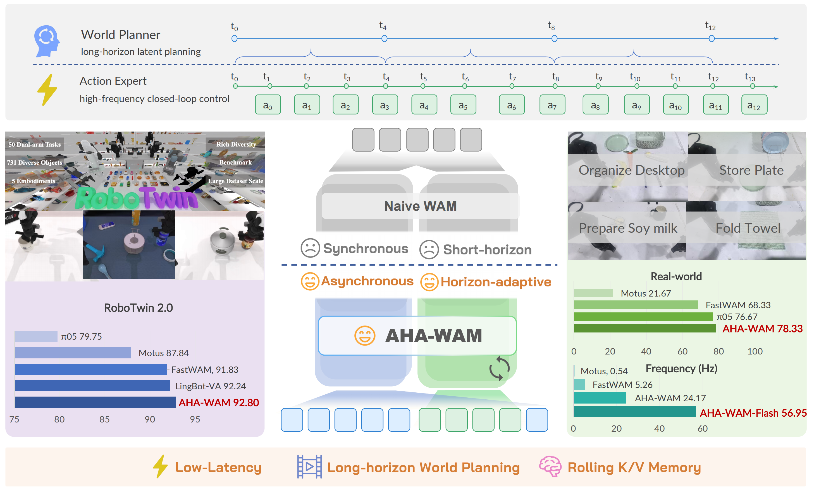
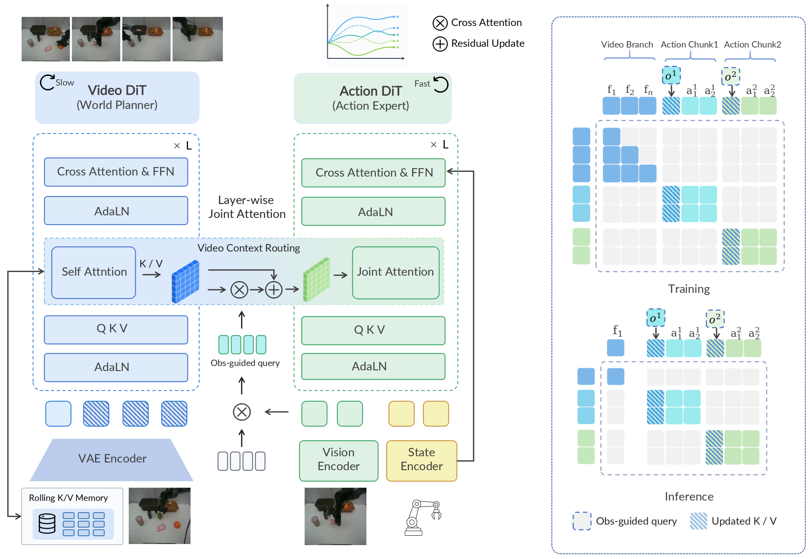

<div align="center">


### Asynchronous Horizon-Adaptive World-Action Modeling with Observation-Guided Context Routing

[](https://serene-sivy.github.io/aha-wam/)
[](https://arxiv.org/abs/2606.09811)
[](https://huggingface.co/SereneC/AHA-WAM-RoboTwin2.0)
[](./LICENSE)

<br>



</div>

## 📚 Contents

- [✨ Highlights](#highlights)
- [🗂️ Repository Layout](#repository-layout)
- [⚙️ Environment](#environment)
- [📦 Model Assets & Checkpoints](#model-assets-and-checkpoints)
- [🧩 Data Preparation](#data-preparation)
- [🚀 Training](#training)
- [🧪 RoboTwin Evaluation](#robotwin-evaluation)
- [🦾 Real-Robot Deployment](#real-robot-deployment)
- [📊 Results](#results)
- [📌 Citation](#citation)

**AHA-WAM** is an asynchronous world-action model for robot manipulation. It
decouples a slow video-DiT world planner from a fast action-DiT executor, then
uses observation-guided context routing to keep the reused world context aligned
with the latest closed-loop robot state.

This repository contains AHA-WAM training, RoboTwin evaluation, and real-robot
deployment code. We also release a RoboTwin2.0 checkpoint on Hugging Face:
[SereneC/AHA-WAM-RoboTwin2.0](https://huggingface.co/SereneC/AHA-WAM-RoboTwin2.0).

<a id="highlights"></a>

## ✨ Highlights

- **Asynchronous planner-executor modeling.** A low-frequency video planner
  computes reusable long-horizon world context, while a high-frequency action
  expert predicts short closed-loop action chunks.
- **Observation-Guided Video-Context Routing (OVCR).** The latest observation
  routes and updates the planner context before each action prediction, avoiding
  expensive video-DiT reruns at every control step.
- **Horizon-adaptive offset training.** The action executor is trained under
  variable planner-executor phase offsets, making the asynchronous interface
  robust to streaming deployment.
- **Practical release surface.** The repo includes RoboTwin-format data
  pipelines, DeepSpeed training launchers, RoboTwin evaluation entrypoints, and
  TCP/ROS deployment templates.

<div align="center">
  
</div>

The key idea is that world prediction and action execution should not be forced
to share the same temporal rhythm: world modeling benefits from a longer,
slower horizon, while robot control needs fast closed-loop corrections.

<a id="repository-layout"></a>

## 🗂️ Repository Layout

```text
AHA-WAM/
├── assets/                   # README figures
├── configs/
│   ├── data/                 # Dataset configs
│   ├── model/                # AHA-WAM model configs
│   ├── task/                 # Training task configs
│   ├── deploy.yml            # Hydra config for real-robot deployment
│   ├── sim_robotwin.yaml     # RoboTwin evaluation config
│   └── train.yaml            # Base training config
├── scripts/
│   ├── train.py
│   ├── train_zero1.sh        # DeepSpeed ZeRO-1 training entrypoint
│   ├── train_zero2.sh        # DeepSpeed ZeRO-2 training entrypoint
│   ├── preprocess_action_dit_backbone.py
│   └── precompute_text_embeds.py
├── experiments/
│   └── robotwin/             # RoboTwin evaluation entrypoints and policy adapter
├── deploy/                   # Real-robot server/client deployment examples
├── src/ahawam/               # Python package
├── data/                     # Local datasets
├── runs/                     # Training outputs
└── evaluate_results/         # Evaluation outputs
```

<a id="environment"></a>

## ⚙️ Environment

Set up the Python environment with:

```bash
conda create -n ahawam python=3.10 -y
conda activate ahawam
pip install -U pip
pip install torch==2.7.1+cu128 torchvision==0.22.1+cu128 \
  --extra-index-url https://download.pytorch.org/whl/cu128
pip install -e .
```

If you use the shell launchers, make sure `accelerate` and `deepspeed` are
available from this environment. They are listed in `pyproject.toml`.

<a id="model-assets-and-checkpoints"></a>

## 📦 Model Assets & Checkpoints

This project uses three kinds of model assets:

1. **Wan base components**: Wan2.2-TI2V-5B video DiT, Wan VAE, text encoder, and
   tokenizer.
2. **ActionDiT backbone**: initialized from the Wan video DiT by
   `scripts/preprocess_action_dit_backbone.py`.
3. **AHA-WAM RoboTwin checkpoint**: the released task checkpoint
   `robotwin_ahawam.pt` and its `dataset_stats.json`.

### Wan Base Components

The loader follows DiffSynth-style `ModelConfig.download_if_necessary()`.
If required files are missing, the first run downloads them automatically.
By default, downloads use ModelScope and are cached under `./checkpoints/`.

```bash
# Optional: choose a shared model cache outside the repo.
export DIFFSYNTH_MODEL_BASE_PATH=/path/to/wan_models

# Optional: choose the download backend. Default is modelscope.
export DIFFSYNTH_DOWNLOAD_SOURCE=modelscope  # or huggingface
```

With the default AHA-WAM config, the code looks for:

```text
Wan-AI/Wan2.2-TI2V-5B/diffusion_pytorch_model*.safetensors
DiffSynth-Studio/Wan-Series-Converted-Safetensors/models_t5_umt5-xxl-enc-bf16.safetensors
DiffSynth-Studio/Wan-Series-Converted-Safetensors/Wan2.2_VAE.safetensors
Wan-AI/Wan2.1-T2V-1.3B/google/umt5-xxl/
```

The text encoder and VAE are redirected to
[`DiffSynth-Studio/Wan-Series-Converted-Safetensors`](https://www.modelscope.cn/models/DiffSynth-Studio/Wan-Series-Converted-Safetensors)
when `redirect_common_files: true`, which is the default in
[`configs/model/ahawam.yaml`](./configs/model/ahawam.yaml). You can also use a
Hugging Face mirror such as
[`SereneC/wan-series-checkpoint`](https://huggingface.co/SereneC/wan-series-checkpoint)
by setting `DIFFSYNTH_DOWNLOAD_SOURCE=huggingface`. Only override `model.model_id`
when the mirror preserves the exact file patterns expected by the loader;
otherwise, place the files manually under the expected local paths.

To avoid any network access, place the files manually under
`$DIFFSYNTH_MODEL_BASE_PATH/<model_id>/...` and optionally set:

```bash
export DIFFSYNTH_SKIP_DOWNLOAD=true
```

### ActionDiT Backbone

Before training AHA-WAM from scratch, generate the ActionDiT backbone:

```bash
python scripts/preprocess_action_dit_backbone.py \
  --model-config configs/model/ahawam.yaml \
  --output /path/to/ActionDiT_linear_interp_Wan22_alphascale_1024hdim.pt \
  --device cuda \
  --dtype bfloat16
```

Then set `model.action_dit_pretrained_path` in your task config or pass it as a
Hydra override when launching training.

### Released RoboTwin Checkpoint

We release the RoboTwin2.0 checkpoint trained with
[`configs/task/robotwin_ahawam.yaml`](./configs/task/robotwin_ahawam.yaml):

```bash
huggingface-cli download SereneC/AHA-WAM-RoboTwin2.0 \
  robotwin_ahawam.pt dataset_stats.json \
  --local-dir checkpoints/AHA-WAM-RoboTwin2.0
```

The checkpoint is loaded through this codebase, not through
`transformers.from_pretrained()`:

```python
from pathlib import Path

import torch
from hydra import compose, initialize_config_dir
from hydra.utils import instantiate

with initialize_config_dir(
    version_base="1.3",
    config_dir=str(Path("configs").resolve()),
):
    cfg = compose(
        config_name="sim_robotwin.yaml",
        overrides=[
            "task=robotwin_ahawam",
            "model.load_text_encoder=true",
            "model.skip_dit_load_from_pretrain=true",
            "model.action_dit_pretrained_path=null",
        ],
    )

model = instantiate(cfg.model, model_dtype=torch.bfloat16, device="cuda")
model.load_checkpoint("checkpoints/AHA-WAM-RoboTwin2.0/robotwin_ahawam.pt")
model = model.cuda().eval()
```

See the Hugging Face model card for more details:
[SereneC/AHA-WAM-RoboTwin2.0](https://huggingface.co/SereneC/AHA-WAM-RoboTwin2.0).

<a id="data-preparation"></a>

## 🧩 Data Preparation

The training configs expect LeRobot-style RoboTwin trajectories. You can either
download a preprocessed release or convert raw RoboTwin trajectories into the
same format.

### Option A: Download Preprocessed RoboTwin2.0 Data

We use a LeRobot-compatible RoboTwin2.0 layout. A convenient public release is
[`yuanty/robotwin2.0-fastwam`](https://huggingface.co/datasets/yuanty/robotwin2.0-fastwam),
which provides a preprocessed RoboTwin2.0 derivative in LeRobot `v2.1` format.
The dataset card distributes split archives. Download all parts, then
reconstruct and extract them:

```bash
huggingface-cli download yuanty/robotwin2.0-fastwam \
  --repo-type dataset \
  --local-dir data/robotwin2.0-fastwam

cd data/robotwin2.0-fastwam
cat robotwin2.0.tar.gz.part-* | tar -xzf -
cd -
```

After extraction, point the config to the recovered `robotwin2.0/` directory.
The expected structure is:

```text
data/robotwin2.0/
└── robotwin2.0/
    ├── data/
    ├── meta/
    └── videos/
```

### Option B: Convert Raw RoboTwin Data

If you start from the upstream RoboTwin source data, convert it to a
LeRobot-compatible directory with `data/`, `meta/`, and `videos/`. The keys
should match [`configs/data/robotwin.yaml`](./configs/data/robotwin.yaml):

```text
observation.images.cam_high
observation.images.cam_left_wrist
observation.images.cam_right_wrist
observation.state.default        # 14-D
action.default                   # 14-D
task
```

The loader reads the directory through the bundled LeRobot dataset wrapper, so
the converted data should include LeRobot metadata such as `meta/info.json`,
`meta/tasks.jsonl`, `meta/episodes.jsonl`, parquet data files, and mp4 videos.

Update the placeholder paths in `configs/data/robotwin.yaml` or override them on
the command line:

```yaml
data.train.dataset_dirs: [/path/to/robotwin2.0]
data.val.dataset_dirs: [/path/to/robotwin2.0]
data.train.pretrained_norm_stats: /path/to/dataset_stats.json
data.val.pretrained_norm_stats: /path/to/dataset_stats.json
```

If you do not already have `dataset_stats.json`, set `pretrained_norm_stats` to
`null` for the first run. Training will write dataset statistics into the run
output directory; you can reuse that file for later runs.

<a id="training"></a>

## 🚀 Training

### 1. Precompute Text Embeddings

```bash
python scripts/precompute_text_embeds.py task=robotwin_ahawam
```

For the offset variant:

```bash
python scripts/precompute_text_embeds.py task=robotwin_ahawam_offset
```

For multi-GPU preprocessing:

```bash
torchrun --standalone --nproc_per_node=8 scripts/precompute_text_embeds.py task=robotwin_ahawam
```

### 2. Launch Training

The launch scripts default to `task=robotwin_ahawam` and `model=ahawam` if you do
not pass explicit overrides:

```bash
bash scripts/train_zero1.sh 8
```

Common task configs:

```text
robotwin_ahawam
robotwin_ahawam_offset
robotwin_ahawam_ode
robotwin_ahawam_offset_ode
```

Examples:

```bash
# AHA-WAM training
bash scripts/train_zero1.sh 8 task=robotwin_ahawam

# Offset-aware AHA-WAM training
bash scripts/train_zero1.sh 8 task=robotwin_ahawam_offset

# ODE distillation variant
bash scripts/train_zero1.sh 8 task=robotwin_ahawam_ode
```

For multi-node training, follow the usage text in `scripts/train_zero1.sh` and
set `NNODES`, `NODE_RANK`, `MASTER_ADDR`, `MASTER_PORT`, and a shared `RUN_ID`.

<a id="robotwin-evaluation"></a>

## 🧪 RoboTwin Evaluation

RoboTwin evaluation uses `configs/sim_robotwin.yaml` and the policy adapter under
`experiments/robotwin/ahawam_policy`.

Install and prepare RoboTwin following the upstream RoboTwin instructions, then
point the config to your RoboTwin checkout:

```yaml
EVALUATION.robotwin_root: /path/to/RoboTwin
```

Create or refresh the policy symlink in the same RoboTwin checkout:

```bash
ROBOTWIN_ROOT=/path/to/RoboTwin
ln -sfn "$(pwd)/experiments/robotwin/ahawam_policy" "$ROBOTWIN_ROOT/policy/ahawam_policy"
```

Run evaluation with the released Hugging Face checkpoint:

```bash
python experiments/robotwin/run_robotwin_manager.py \
  task=robotwin_ahawam \
  ckpt=checkpoints/AHA-WAM-RoboTwin2.0/robotwin_ahawam.pt \
  EVALUATION.dataset_stats_path=checkpoints/AHA-WAM-RoboTwin2.0/dataset_stats.json \
  EVALUATION.robotwin_root=/path/to/RoboTwin \
  MULTIRUN.num_gpus=8
```

Use `MULTIRUN.num_gpus=<N>` to adjust the number of GPUs used by the manager.

<a id="real-robot-deployment"></a>

## 🦾 Real-Robot Deployment

Deployment utilities live under [`deploy/`](./deploy/). We provide a
server-client real-robot deployment framework example for reference. It includes
a GPU-side TCP policy server, a robot/client-side interface, smoke-test clients,
and an asynchronous dual-stream WAM runtime example where the video branch and
action branch are served by separate workers/threads. The transport uses a
simple length-prefixed pickle protocol and should only be used on trusted robot
networks.

Start from the neutral example config:

```bash
cp deploy/deploy_example.yml deploy/deploy.yml
# edit checkpoint_path, dataset_stats_path, project_root, and inference options
```

The deployment policy composes [`configs/deploy.yml`](./configs/deploy.yml) by
default. If `task` is left `null`, it uses the default task in that Hydra config
(currently `robotwin_ahawam_offset`); set a task name here to override it:

```yaml
hydra_config_name: deploy
task: null  # uses configs/deploy.yml default; set a task name to override it
```

Run the server on the GPU workstation:

```bash
python deploy/server/wam_policy_server.py \
  --policy-path deploy/deploy.yml \
  --policy-module deploy.server.ahawam_policy \
  --policy-class AHAWAMPolicy \
  --instruction "your task instruction" \
  --action-dim 14 \
  --host 0.0.0.0 \
  --port 10000
```

For async video/action serving, add `--async-mode` for a single async runtime or
`--dual-gpu-async --video-gpu 0 --action-gpu 1` for the dual-stream example that
separates video-branch and action-branch workers.

Smoke-test the sync TCP path without ROS:

```bash
python deploy/client/wam_policy_dummy_client.py \
  --host 127.0.0.1 \
  --port 10000 \
  --instruction "your task instruction" \
  --num-requests 1
```

Smoke-test the async/dual-device protocol path without ROS:

```bash
python deploy/client/wam_policy_async_dummy_client.py \
  --host 127.0.0.1 \
  --port 10000 \
  --instruction "your task instruction" \
  --num-action-requests 10
```

On the robot computer, run the ROS bridge after checking topics and safety
limits. Use `--dry-run` first:

```bash
python deploy/client/wam_remote_client_node.py \
  --server-ip <GPU_WORKSTATION_IP> \
  --server-port 10000 \
  --instruction "your task instruction" \
  --dry-run
```

See [`deploy/README.md`](./deploy/README.md) for the full server/client guide and
safety notes.

<a id="results"></a>

## 📊 Results

### RoboTwin2.0 Success Rate

Average success over 50 RoboTwin2.0 dual-arm manipulation tasks. `Robo. P.T.`
indicates whether the method uses embodied robot-data pretraining before
RoboTwin training.

| Method | Robo. P.T. | Clean (%) | Randomized (%) | Avg. (%) |
| --- | :---: | ---: | ---: | ---: |
| π0 | ✓ | 65.92 | 58.40 | 62.16 |
| π0.5 | ✓ | 82.74 | 76.76 | 79.75 |
| ABot-M0 | ✓ | 81.20 | 80.40 | 80.80 |
| Motus from Wan2.2 | ✗ | 77.56 | 77.00 | 77.28 |
| Motus | ✓ | 88.66 | 87.02 | 87.84 |
| LingBot-VA | ✓ | 92.90 | 91.50 | 92.20 |
| Fast-WAM | ✗ | 91.88 | 91.78 | 91.83 |
| AHA-WAM-Flash | ✗ | 90.48 | 89.92 | 90.20 |
| **AHA-WAM** | ✗ | **93.40** | **92.20** | **92.80** |

### Closed-Loop Inference Latency

Latency and frequency are reported for closed-loop action generation. Speedup is
relative to Fast-WAM. Benefiting from the asynchronous planner-executor schedule
and low-level inference optimizations, AHA-WAM amortizes expensive Video-DiT
planner computation while keeping the Action-DiT executor on the closed-loop
control path.

| Method | Latency (ms) | Frequency (Hz) | Speedup |
| --- | ---: | ---: | ---: |
| Motus | 1866.10 | 0.54 | 0.10x |
| Fast-WAM | 190.00 | 5.26 | 1.00x |
| **AHA-WAM** | **41.37** | **24.17** | **4.59x** |
| **AHA-WAM-Flash** | **17.56** | **56.95** | **10.82x** |

The paper also reports **78.3%** average success across four real-world
manipulation tasks.

<a id="acknowledgements"></a>

## 🙏 Acknowledgements

We gratefully acknowledge the open-source contributions of
[FastWAM](https://github.com/yuantianyuan01/FastWAM) and
[RoboTwin](https://github.com/robotwin-Platform/robotwin). AHA-WAM benefits from
their released code, benchmark environments, data processing pipelines, and
evaluation infrastructure. We sincerely thank the authors and contributors for
making these resources publicly available.

<a id="citation"></a>

## 📌 Citation

If you find AHA-WAM useful, please cite the project:

```bibtex
@article{cai2026ahawam,
  title={AHA-WAM: Asynchronous Horizon-Adaptive World-Action Modeling with Observation-Guided Context Routing},
  author={Cai, Jisong and Ling, Long and Chu, Shiwei and Liu, Zhongshan and Kang, Jiayue and Liang, Zhixuan and Xu, Wenjie and Mao, Yinan and Zhang, Weinan and Yang, Xiaokang and Ying, Ru and Zheng, Ran and Mu, Yao},
  journal={arXiv preprint arXiv:2606.09811},
  year={2026}
}
```

## 📄 License

This repository is released under the [MIT License](./LICENSE), except for
third-party code and assets that retain their original licenses.
